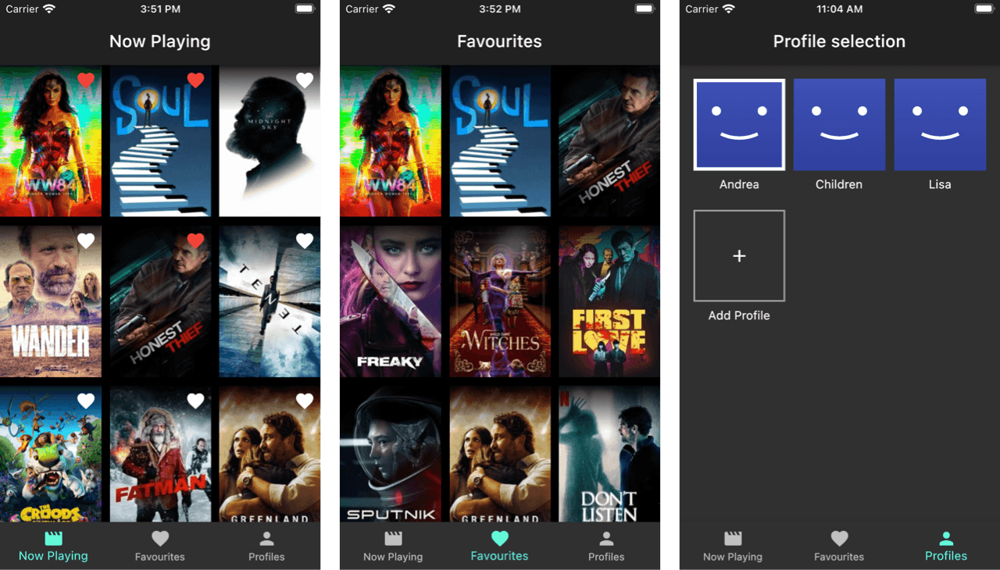

# Flutter State Management: Movie App with Provider, Riverpod, flutter_bloc 

This reference project shows how to implement a (Netflix-inspired) movie app with different state management techniques in Flutter:



The project uses the [TMDB API](https://www.themoviedb.org/documentation/api) to fetch a list of movies, and includes features such as pagination and local storage.

### Running the project

Before running, see instructions on how to [get a TMDB API key](#getting-a-tmdb-api-key).

Also, make sure to run on **Flutter beta** channel.

## App Overview

The application is composed by three primary screens: **Now Playing**, **Favourites** and **Profiles**.

On first launch, the app asks the user to create a profile. 

The **Now Playing** page loads a list of current movies from the TMDB API. Results are paginated and scrolling to the bottom causes the next page to be loaded.

Each movie shows as a poster using the image URL retrieved from the API. You can tap on the ❤️ icon to add a movie as a favourite (for the selected profile), and this preference is persisted to local disk.

Open the **Favourites** page to see the list of favourites for the currently selected profile.

Use the **Profiles** page to create additional profiles and update the currently selected profile (this is inspired by the Netflix UI).

## Features

- "Now Playing" movies (with pagination)
- Save favourites to watch list
- Multiple profiles (like Netflix)
- Local data persistence (movies, favourites, profiles) with Sembast

Combining these features together makes for an interesting case study about state management in Flutter.

## App Structure

This app was made to compare and contrast multiple state management approaches. A **highly composable** architecture has been designed to enable this.

The project folders are structured like this:

```
/apps
  /flutter_bloc
  /riverpod
  /provider
  ... and more
/packages
  /core
    /lib
      /api
      /models
        /app_models
        /app_state
        /tmdb
      /persistence
      /ui
```

Each folder inside `apps` is a Flutter project that implements the same app with a specific state management package.

All common functionality lives in `packages/core`. This includes a TMDB API wrapper, along with model classes with supporting serialization code where needed.

The `persistence` folder contains a `DataStore` abstract class that is used by all apps, along with a concrete `SembastDataStore` class to read and write data to local storage (using Sembast as a NoSQL database).

The `ui` folder contains all the custom widgets that are shared by all apps. These widgets **do not hold any business logic** and are designed to **show the app UI** and **expose callbacks** for the application code to plug into (much like the built-in Flutter widgets).

All the logic lives inside the apps themselves. All apps have exactly the same folders:

```
lib
  /app
    /app_startup
    /create_profile
    /favourites
    /now_playing
    /profile_selection
```

The business logic and screen flows are identical for each app, but the semantics change depending on which state management package is used. This makes it easy to compare and constrast different solutions.

## Supported state management solutions

The current state management solutions are currently supported:

- [x] [Provider](https://pub.dev/packages/provider) (using `StateNotifier`)
- [x] [flutter_bloc](https://pub.dev/packages/flutter_bloc) (using `Cubit`)
- [x] [Riverpod](https://pub.dev/packages/riverpod) (using `StateNotifier`)

I plan to add more in the future (PRs welcome!).

## Future Roadmap

- Convert project to null safety (once the Freezed package supports this).
- Add more screens
- Polish the UI
- Replace `http` with `dio` to support request cancellation

Feel free to open issues if you'd like certain features to be implemented (though keep your expectations low, I'm doing this for free after all 😉).

## Other packages in use

The "core" package of the app uses the following packages:

- [Freezed](https://pub.dev/packages/freezed) for app state and [json_annotation](https://pub.dev/packages/json_annotation) for data serialization
- [Sembast](https://pub.dev/packages/sembast) for local data persistence
- [http](https://pub.dev/packages/http) for the API client
- [rxdart](https://pub.dev/packages/rxdart) for combining streams
  
## Getting a TMDB API key

This project uses the TMDB API to get the latest movies data.

Before running the app you need to [sign up on the TMDB website](https://www.themoviedb.org/signup), then obtain an API key on the [settings API page](https://www.themoviedb.org/settings/api).

Once you have this, create an `api_keys.dart` file inside `packages/core/lib/api`, and add your key:

```dart
// api_keys.dart
String tmdbApiKey = "your-api-key";
```

Congratulations, you're good to go. 😎

## Note: Loading images from insecure HTTP endpoints

The data returned by the TMBD API points to image URLs using http rather than https. In order for images to load correctly, the following changes have been made:

### Android

Created a file at `android/app/src/main/res/xml/network_security_config.xml` with these contents:

```
<?xml version="1.0" encoding="utf-8"?>
<network-security-config>
    <base-config cleartextTrafficPermitted="true" />
</network-security-config>
```

Added this to the application tag in the `AndroidManifest.xml`:

```
android:networkSecurityConfig="@xml/network_security_config"
```

### iOS

Add the following to `ios/Runner/info.pList`:

```
  <key>NSAppTransportSecurity</key>
  <dict>
      <key>NSAllowsArbitraryLoads</key>
      <true/>
  </dict>
```

More information here:

- [Insecure HTTP connections are disabled by default on iOS and Android.](https://flutter.dev/docs/release/breaking-changes/network-policy-ios-android)

## Credits

This project was inspired by [flutter\_architecture\_samples](https://github.com/brianegan/flutter_architecture_samples) by the Flutter community.

## [LICENSE: MIT](LICENSE.md)